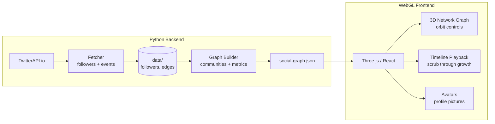

# Social Graph

A 3D interactive visualization of your Twitter network growth over time. Watch followers appear, form communities, and see how your network evolves.



## Features

- 3D network graph with orbit controls (WebGL)
- Timeline playback — scrub through your network's growth history
- Community detection — automatic clustering of related accounts
- Profile pictures on every node
- Cumulative growth visualization
- Forkable — bring your own API key via `.env`

## Stack

| Layer | Technology |
|-------|-----------|
| Data | Python 3.10+, TwitterAPI.io |
| Graph | NetworkX, community detection |
| Frontend | React, Three.js, TypeScript |
| Visualization | 3D force-directed layout |

## Quick Start

```bash
# Backend
pip install -r requirements.txt
cp .env.example .env              # add TWITTER_API_KEY
python -m src.cli fetch --days 30
python -m src.cli build

# Frontend
cd frontend && npm install && npm run dev
```

## CLI Commands

| Command | Purpose |
|---------|---------|
| `python -m src.cli init` | Initialize data directories |
| `python -m src.cli fetch --days 30` | Fetch follower events |
| `python -m src.cli build` | Build graph JSON for frontend |
| `python -m src.cli export --format json` | Export raw data |

## License

MIT
